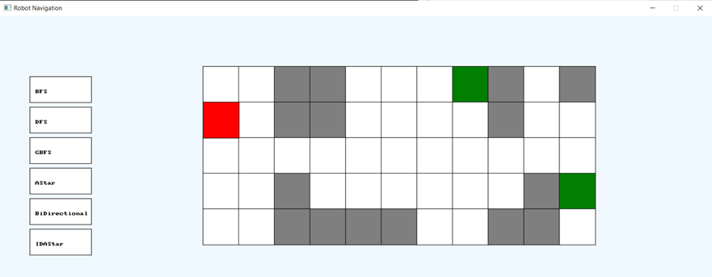
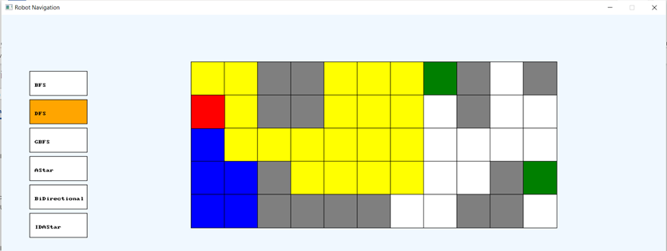

A C# (.NET) program with GUI that solves the classic Robot Navigation problem.

The following search algorithms were implemented:
+ Depth-First Search
+ Breadth-First Search
+ Greedy Best First Search
+ A*
+ Bidirectional Search
+ Iterative Deepening A*

Please refer to the [report](Report.pdf) about:
+ How to run the application
+ Details of the algorithms and their implementations
+ Results of test cases
+ Bugs found
  
**Note: You will need the Splashkit library and .NET 6.0 or above to run the application**

The following are sample images of working application:

